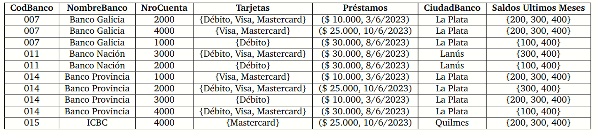

# Resolución Modelo de 2do Parcial

## SQL

Teniendo en cuenta el siguiente esquema: 
```
ACCIONISTA <CUIT(PK), nyAp, cobrados, fecha_ingreso, {domicilio_calle, domicilio_nro, domicilio_loc, domicilio_provincia}>
INVIERTE <nombre(PK, FK), CUIT(PK,FK)>
BANCO <nombre(PK), tipo_empresa, fundado>
SUCURSAL <numero_sucursal(PK), nombre(PK,FK), domicilio, localidad, provincia>
CUENTA <numero(PK), numero_sucursal(PK, FK), nombre(PK, FK), moneda, saldo, activa>
TRANSFIERE <numero_transfiere(PK, FK), numero_sucursal_transfiere(PK, FK), nombre_transfiere(PK, FK), numero_recibe(PK, FK), numero_sucursal_recibe(PK, FK), nombre_recibe(PK, FK), fecha_hora(PK), monto>
```

Realizar las siguientes consultas usando SQL:

```sql
--1 Devolver nyAp y cuántos años hace que ingresaron los accionistas de la provincia de Salta o Chubut que invierten en bancos públicos. Ordenados por nyAp de menor a mayor.
SELECT a.nyAp, YEAR(CURRENT_DATE()) - YEAR(a.fecha_ingreso) AS años_ingreso
FROM accionista AS a
JOIN invierte AS i ON i.CUIT = a.CUIT
JOIN banco AS b ON b.nombre = i.nombre
WHERE a.domicilio_provincia IN ('Salta', 'Chubut') AND b.tipo_empresa = 'Publico'
ORDER BY a.nyAp DESC;

--2 Devolver para cada accionista que haya ingresado antes del 2010, la cantidad de bancos grandes en los que invierte. Los grandes bancos son aquellos con más de 7 sucursales.
SELECT a.nyAp, COUNT(b.nombre)
FROM accionista AS a
JOIN invierte AS i ON i.CUIT = a.CUIT
JOIN banco AS b ON b.nombre = i.nombre
JOIN sucursal AS s ON s.nombre = b.nombre
GROUP BY a.nyAp
HAVING a.fecha_ingreso < YEAR(2009) AND COUNT(b.nombre) > 7;

--3 Devolver las sucursales de los bancos de las provincia de Neuquén que tengan cuentas en "Yuanes" que hayan sido fundados antes del 2001 y sucursales con accionistas que hayan ingresado al banco el mismo año de su fundación.
SELECT s.numero_sucursal
FROM sucursal AS s
JOIN cuenta AS c ON c.numero_sucursal = s.numero_sucursal
JOIN banco AS b ON b.nombre = c.nombre
JOIN invierte as i ON i.nombre = b.nombre
JOIN accionista AS a ON a.CUIT = i.CUIT  
WHERE (s.provincia = 'Neuquén' AND c.moneda = 'Yuanes') OR a.fecha_ingreso = b.fundado;

--4 Generar un listado de bancos que incluya cantidad de sucursales y cantidad de cuentas por provincia de cada uno.
SELECT b.nombre, s.provincia, COUNT(DISTINCT s.numero_sucursal), COUNT(c.numero) 
FROM banco AS b
JOIN sucursal AS s ON s.nombre = b.nombre
JOIN cuenta AS c ON c.numero_sucursal = s.numero_sucursal
GROUP BY b.nombre, s.provincia

--5 Devolver las cuentas inactivas que tengan transferencias superiores a la media de los bancos de tipo "Privado" realizadas antes del 2010.
SELECT c.numero 
FROM cuenta AS c
JOIN banco AS b ON c.nombre = b.nombre
JOIN transfiere AS t ON t.numero_transfiere = c.numero 
WHERE b.tipo_empresa = 'Privado' AND c.activa = 0 AND t.monto > (SELECT AVG(monto) FROM transfiere);

--6 Devolver todos los bancos y el año de fundación, de aquellas instituciones cuyas sucursales registren cuentas ACTIVAS con transferencias en dólares mayores a 2000.
SELECT b.nombre, YEAR(b.fundado)
FROM banco AS b 
JOIN sucursal AS s ON s.nombre = b.nombre
JOIN cuenta AS c ON c.numero_sucursal = s.numero_sucursal
JOIN transferencia AS t ON t.numero_transfiere = c.numero
WHERE c.activa = 1 AND c.moneda = 'Dolar' AND t.monto > 2000;
```

## Normalización

En la oficina de Recursos Humanos nos solicitan organizar la información bancaria de todo el equipo docente de la Universidad. La base de datos con la cuenta esta oficina es la siguiente:
```
<nomBanco, #cuenta, saldo, tipo, montoDescubierto, #prestamo, montoTotalPrestamo, #tarjeta, montoMaximoGasto, DNIPresidenteBanco, nyapPresidente, ciudadPresidente>
```
dadas las restricciones (los ejemplos son ilustrativos para entender las restricciones, pero no es la única opción en las tablas):

1. Cada banco se identifica en forma unívoca con nomBanco, y sabemos que tiene un solo presidente, que se identifica
en forma unívoca con el DNI. A su vez, sabemos que una persona puede ser presidente de varios bancos (dado que
tiene mucho poder). Por ejemplo, el Banco Nación y el Banco Santander Río tiene como presidente al DNI 17.456.789 (es
decir, el presidente se repite para ambos bancos), pero es solamente uno, y el Banco Galicia tiene al DNI 18.256.385.
2. De cada presidente, sabemos el nombre y apellido y la ciudad donde vive. Dos presidentes pueden llamarse de la
misma manera y también vivir en la misma ciudad. Por ejemplo, el DNI 17.456.789 identifica a Juan Curuchet y vive en
La Plata, y el DNI 18.256.385 identifica a Juan Cruz que también vive en La Plata. A su vez, el DNI 22.356.458 identifica
a Juan Curuchet que vive en Tandil.
3. Sabemos que #cuenta es única por banco, pero puede repetirse entre diferentes bancos. Para una cuenta de un banco,
conocemos cuál es su saldo actual y cuál es el tipo de cuenta que es (caja de ahorros, cuenta corriente, etc.). El saldo
y el tipo pueden repetirse entre diferentes cuentas de un mismo o de diferentes bancos. Por ejemplo, el Banco Nación
tiene las cuentas 001, 002 y 003, el Banco Santander Río tiene las cuentas 002, 003 y 005, y el Banco Galicia tiene las
cuentas 001, 005, 006. Si vemos los saldos y los tipos de algunas cuentas, tendremos que el Banco Nación en la cuenta
001 tiene saldo $ 10.000 y es una cuenta de ahorros, el Banco Santander Río tiene la cuenta 002 tiene saldo $ 10.000 y
es una cuenta corriente, y El Banco Galicia en la cuenta 001 tiene $ 15.000 y es una caja de ahorros.
4. Sabemos por reglamento de todos los bancos, que sin importar la cuenta o el banco, cada tipo de cuenta tiene un
montoDescubierto (es el monto que podés gastar cuando ya no tenés más dinero en la cuenta) que es el mismo para
todas las cuentas del mismo tipo. El montoDescubierto puede repetirse entre diferentes tipos de cuentas. Por ejemplo,
las cajas de ahorros tienen un descubierto de $ 15.000, las cuentas corrientes tienen un descubierto de $ 15.000, y las
cuentas sueldo tienen una cuenta de $ 10.000.
5. Cada banco ofrece diferentes préstamos, que se identifican con un número único por banco, pero que se puede repetir
en diferentes bancos. El préstamo de un banco tiene un monto total de dinero que puede prestarse. Los montos
pueden repetirse entre diferentes préstamos de un mismo banco o diferentes bancos. Por ejemplo, el Banco Nación en
las cuentas 001 con el número de préstamo 201 y 202 tienen un monto de $ 20.000, y el Banco Santander Río en la
cuenta 002 con los números de préstamo de 201 y 203 tienen un monto de $ 20.000, y el Banco Galicia en la cuenta 002
con los números de préstamo de 202 y 203 tienen un monto de $ 5.000.
6. Sabemos que cada cuenta tiene varias tarjetas (pueden ser de débito o de crédito). Cada tarjeta de una cuenta de un
banco tiene un monto máximo de gasto. Los números de tarjetas no se repiten en la misma cuenta de un banco, pero
pueden repetirse entre cuentas del mismo o diferentes bancos. El monto máximo se puede repetir entre diferentes
tarjetas de la misma o diferentes cuenta de un banco o de diferentes bancos. Por ejemplo, en el Banco Nación en la
cuenta 001 tiene las tarjetas 2356 con un monto máximo de $ 20.000, y la tarjeta 4568 con un monto máximo de $
25.000. En el mismo banco la cuenta 002 tiene las tarjeta 2356 con un monto máximo de $ 25.000, y en el Banco Galicia,
la cuenta 001 con una tarjeta 4568 tiene un monto máximo de $ 20.000.

```
1. La relación ya se encuentra en 1ra. Forma Normal.
2. Para llevar el esquema a 2FN y 3FN.
	a- Hallar dependencias funcionales.
	b- Determinar la(s) clave(s) candidata(s).
	c- Mostrar el proceso de división, explicitando qué dependencia funcional se aplica y vale en cada relación generada.
	d- Marcar claramente qué formas normales se cumplen en cada relación obtenidas y en las residuales.
	e- Marcar las claves primarias (y foráneas si corresponde) en TODAS las relaciones generadas (finales y residuales).
	f- Mostrar al menos dos relaciones residuales completas con los atributos y la clave claramente identificada en el proceso de 2FN/3FN.
	g- NO tache las relaciones residuales que se van generando en el proceso de división.
```

a. DF1: nomBanco -> DNIPresidenteBanco

   DF2: DNIPresidenteBanco -> nyapPresidente, ciudadPresidente

   DF3: nomBanco, #cuenta -> saldo,tipo
   DF4: tipo -> montoDescubierto    

   DF5: nomBanco, #prestamo -> montoTotalPrestamo

   DF6: nomBanco, #cuenta, #tarjeta -> montoMaximoGasto

   **Notese que tipo es una Dependencia Transitiva (montoDescubierto depende de tipo y tipo, a su vez depende de nomBanco y #cuenta)**

b. {nomBanco, DNIPresidenteBanco, #cuenta, #prestamo, tipo, #tarjeta} - {DNIPresidenteBanco, nyapPresidente, ciudadPresidente, saldo, tipo, montoDescubierto, montoTotalPrestamo, montoMaximoGasto} U 0

Claves Candidatas = {nomBanco, #cuenta, #prestamo, #tarjeta}

c. Proceso de división:

```sql
- R1(Banco) = <nomBanco PK, DNIPresidenteBanco, nyapPresidente, ciudadPresidente>
- R2(Cuenta) = <#cuenta PK, nomBanco PK FK, saldo, tipo FK>
- R3(Prestamo) = <#prestamo PK, nombanco PK FK, montoTotalPrestamo>
- R4(Tarjeta) = <#tarjeta PK, #cuenta PK FK, nomBanco PK FK, montoMaximoGasto>
- R5(TipoCuenta) <tipo PK, montoDescubierto>
```

d. Marcando las formas normales

| Relación   | Todos sus atributos dependen de la PK | No hay dependencias transitivas | 2FN | 3FN |
| ---------- | ------------------------------------- | ------------------------------- | --- | --- |
| Banco      | Si                                    | Si (Osea no hay)                | Si  | Si  |
| Cuenta     | Si                                    | No                              | Si  | No  |
| Prestamo   | Si                                    | Si                              | Si  | Si  |
| Tarjeta    | Si                                    | Si                              | Si  | Si  |
| TipoCuenta | Si                                    | Si                              | Si  | Si  |

e. 

f. Relaciones residuales:

Tomemos la relación original y eliminemos las relaciones obtenidas anteriormente.

<nomBanco, #cuenta, saldo, tipo, montoDescubierto, #prestamo, montoTotalPrestamo, #tarjeta, montoMaximoGasto, DNIPresidenteBanco, nyapPresidente, ciudadPresidente>

## Cuarta Forma Normal

En la oficina de Recursos Humanos nos solicitan organizar la información bancaria de todo el equipo docente de la Universidad. La base de datos con la cuenta esta oficina es la siguiente:

```
<nomBanco, #cuenta, saldo, tipo, montoDescubierto, #prestamo, montoTotalPrestamo, #tarjeta, montoMaximoGasto, DNIPresidenteBanco, nyapPresidente, ciudadPresidente, miembroDirectorio, aplicacion>
```

- Sabemos que los bancos tiene un directorio formado por varios miembros, y cada miembro del Directorio de un banco
aparece en una tupla diferente.
- A su vez, cada cuenta de un banco puede usarse a través de varias aplicaciones. Por ejemplo, una cuenta del Santander
Río podría usar con Modo y la App del Santander, y una cuenta del Banco Nación podría usarse con Modo y la App
del Nación.

## Primera Forma Normal

En la siguiente base de datos tenemos la información de las cuentas de los bancos de Quilmes.



1. Identifique la clave de la relación.
  - La clave de la relación es una clave compuesta por los atributos CodBanco, NroCuenta
2. ¿La relación está en 1FN? Justifique su respuesta.
  - La relación NO está en 1FN puesto que hay atributos compuestos y atributos multivaluados
3. Si la relación no está en 1FN, cómo llevaría esta relación a esta forma normal? Escriba claramente cuáles son los
relaciones resultantes en Primera Formal Normal y marque claramente cuáles son las claves en estas nuevas relaciones
(no es necesario copiar todos los datos).
  - Para llevar la relación a 1FN separaría la relación en subRelaciones
    - BANCO <codBanco PK, NombreBanco, CiudadBanco>
    - CUENTA <NroCuenta PK, codBanco FK>
    - TARJETAS<codBanco FK FKNroCuenta FK, tarjeta>
    - PRESTAMOS<codBanco FK, NroCuenta FK, (montoPrestamo, fechaPrestamo)>
    - SALDOSUM <codBanco FK, NroCuenta FK, saldo1, saldo2, saldo3>


